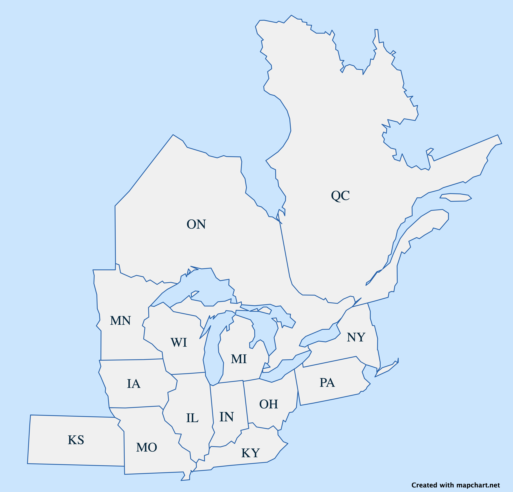
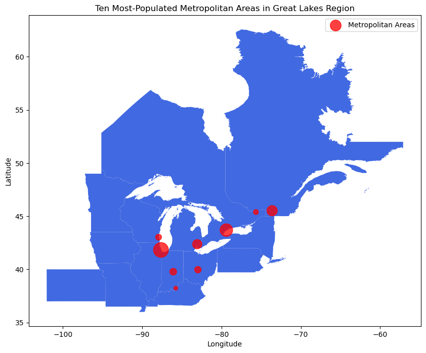
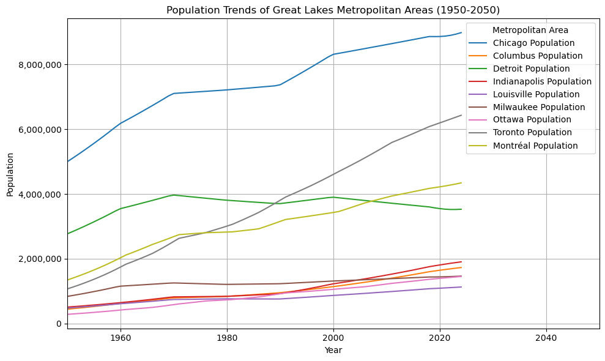
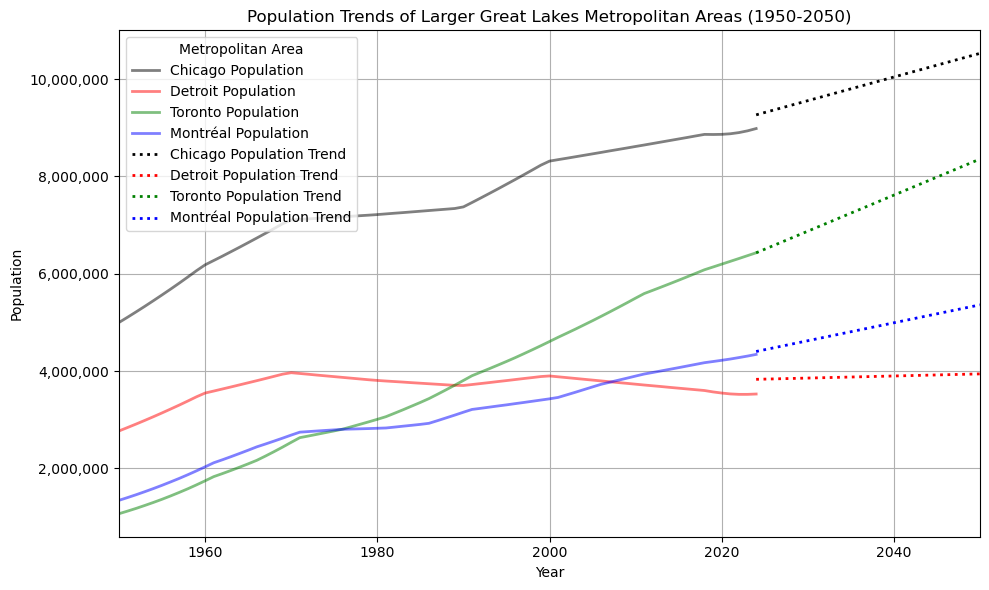
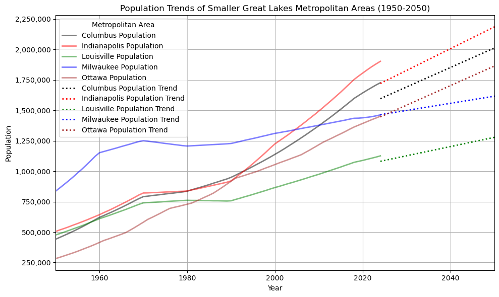
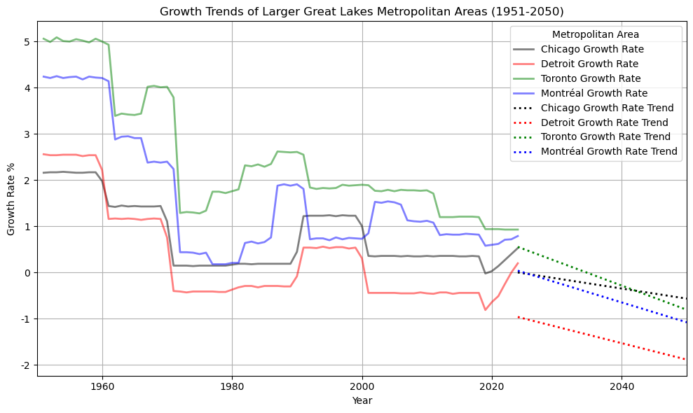
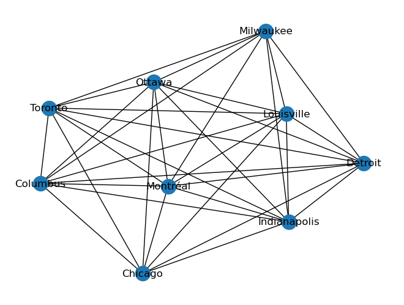
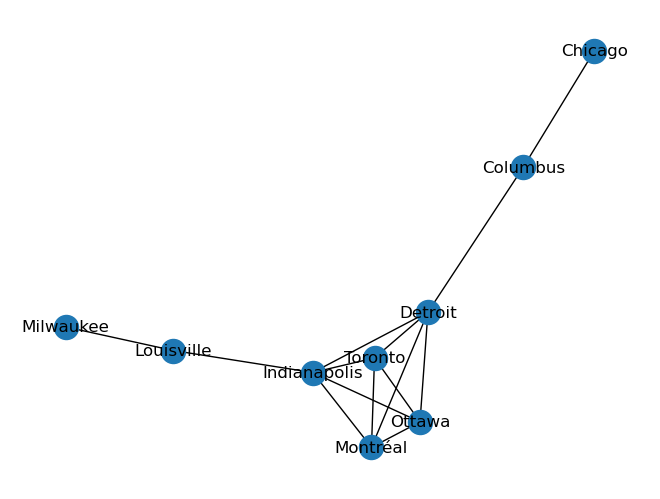

# Great Lakes Region Analysis

- The idea of a **Megalopolis** or **Megaregion** began in the 1960s, and was written about by various architects and planners
- A "Megalopolis/Megaregion" is simply a complex of metropolises, with the resulting political, cultural, and economic importance of being such
- The above map shows the most liberal interpretaion of the political bodies involved in the **Great Lakes Megalopolis**

## Population

- WorldAtlas marks this "megaregion" at about 60 million people, about 47.5% of the 126.3 million that live in the widest interpretation of political bodies
- The ten largest metropolitan areas of this region have a combined population of just under 31 million people

**Population Trends**

- The ten largest metropolitan areas clearly separate into two distinct tiers of population
- Detroit is an outlier with its medium-term down-trend

- Despite the observed down-trend, Detroit is in fact still trending slightly upward across 100 years

- Smaller metropolitan areas tend to deviate more from their trend lines than the larger tier
- Milwaukee somewhat of an outlier

- Very consistent down-trend in growth rates despite a consistent short-term uptick
- Larger metropolitan areas tightly track each other
- Montreal in the 1990s stands out; possibly due to language laws which restricted the use of English in favour of French

- Smaller metropolitan areas again show they deviate more than larger ones: relative to one another and from their own trend lines
- Indianopolis stands out as only metropolitan area of both tiers that has an almost even trend line

- All metropolitan areas show a remarkable uniformity when they are mapped relative to one another according to a 90% similarity threshold of population growth rates

- The uniformity is broken when the threshold is raised to 99%
- Clustering transcends both nationality and the two tiers of metropolitan areas discovered above

- Once threshold is raised from 99 to 99.9%, clustering becomes strictly national, both in tightness and lack thereof

## What's Missing
- Mapping trading partners by provnces and states
- Mapping demographic trends
- Mapping economics and transportation infrastructure of lakes
